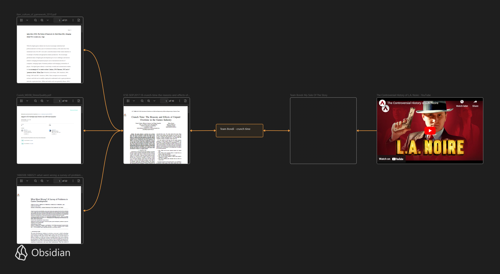

# Paper 01 Quick Notes - References - Brainstorming

Paper's Perspective Lens : [Chapter 01 : Unethical Behaviors in Organizations and Human Nature](../chapter-01-unethical-behaviors-in-organizations-and-human-nature)

## References

- [Crunch Time: The Reasons and Effects of Unpaid Overtime in the Games Industry](../_attachments/ICSE-SEIP.2017.18-crunch-time-the-reasons-and-effects-of-unpaid-overtime-in-the-games-industry.pdf)
  - [F. Petrillo, M. Pimenta, F. Trindade, and C. Dietrich, "What went wrong? a survey of problems in game development"](../_attachments/1486508.1486521-what-went-wrong-a-survey-of-problems-in-game-development.pdf)
  - [A. Kerr, "The culture of gamework"](../_attachments/Kerr_culture_of_gamework_2010.pdf)
  - [B. Akula and J. Cusick, "Impact of overtime and stress on software quality"](../_attachments/Cusick_MEI08_StressQuality.pdf)
- [GVMERS - The Controversial History of L.A. Noire](https://www.youtube.com/watch?v=KO53rj04-ls&t=763s)
- [Team Bondi: My Side Of The Story](https://www.gamedeveloper.com/production/team-bondi-my-side-of-the-story)
