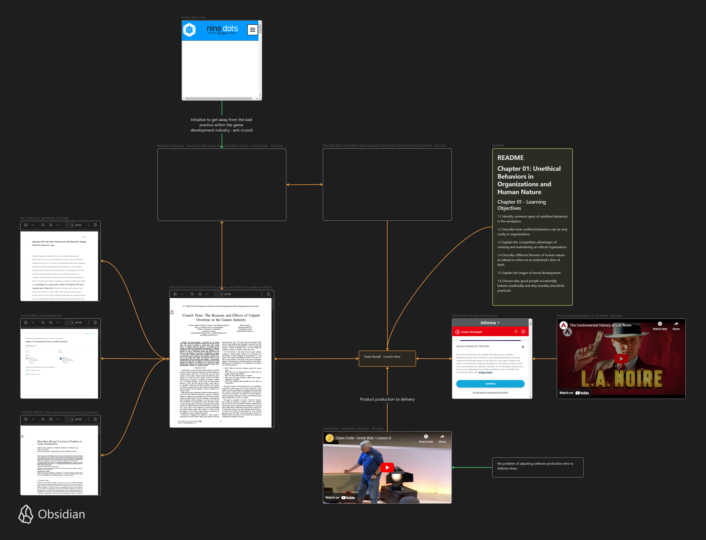

# Paper 01 Quick Notes - References - Brainstorming



Assignment requirements : [assignment-paper-01](assignment-paper-01.md)

Paper's Perspective Lens : [Chapter 01 : Unethical Behaviors in Organizations and Human Nature](../chapter-01-unethical-behaviors-in-organizations-and-human-nature)

Paper's mind map : [Paper's mind map](chosen-topic-for-paper01.canvas)

## References - MLA (8th Edition)

- Business Ethics: Best Practices for Designing and Managing Ethical Organizations

```txt
Kanashiro, Patricia. Business Ethics: Best Practices for Designing and Managing Ethical Organizations, by DENIS COLLINS, SAGE PUBLICATIONS, Thousand Oaks, California, 2021.
```

- [Crunch Time: The Reasons and Effects of Unpaid Overtime in the Games Industry](../_attachments/ICSE-SEIP.2017.18-crunch-time-the-reasons-and-effects-of-unpaid-overtime-in-the-games-industry.pdf) ```

  ```txt
  Edholm, Henrik, et al. “Crunch Time: The Reasons and Effects of Unpaid Overtime in the Games Industry.” 2017 IEEE/ACM 39th International Conference on Software Engineering: Software Engineering in Practice Track (ICSE-SEIP), IEEE Press, 2017, pp. 43–52, https://doi.org/10.1109/ICSE-SEIP.2017.18.
  ```

  - [F. Petrillo, M. Pimenta, F. Trindade, and C. Dietrich, "What went wrong? a survey of problems in game development"](../_attachments/1486508.1486521-what-went-wrong-a-survey-of-problems-in-game-development.pdf)

```txt
  Petrillo, Fábio, et al. “What Went Wrong? A Survey of Problems in Game Development.” Computers in Entertainment, vol. 7, no. 1, 2009, p. 36–.
```

- [A. Kerr, "The culture of gamework"](../_attachments/Kerr_culture_of_gamework_2010.pdf)
- [B. Akula and J. Cusick, "Impact of overtime and stress on software quality"](../_attachments/Cusick_MEI08_StressQuality.pdf)
- [GVMERS - The Controversial History of L.A. Noire](https://www.youtube.com/watch?v=KO53rj04-ls&t=763s)
- [Team Bondi: My Side Of The Story](https://www.gamedeveloper.com/production/team-bondi-my-side-of-the-story)
- [Clean Code - Uncle Bob / Lesson 6](https://www.youtube.com/watch?v=l-gF0vDhJVI&t=1521s)
- [The Dark Side of the Video Game Industry | Patriot Act with Hasan Minhaj | Netflix](https://www.youtube.com/watch?v=pLAi_cmly6Q)
- [Working Conditions - The Deplorable Status Quo that Killed a Studio - Extra Credits](https://www.youtube.com/watch?v=sHBOWPLpXrs)
- [The Gaming Industry | Start Here](https://www.youtube.com/watch?v=LEurg3JaP2o)
- [The cruel optimism of “good crunch”: How game industry discourses perpetuate unsustainable labor practices](../_attachments/cote-harris-2021-the-cruel-optimism-of-good-crunch-how-game-industry-discourses-perpetuate-unsustainable-labor-practices.pdf)
- [A Very Brief History of Computer Science Written by Jeffrey Shallit](https://cs.uwaterloo.ca/~shallit/Courses/134/history.html#:~:text=1960's,at%20Purdue%20University%20in%201962.)

  ```txt
  Shallit, Jeffrey. “A Very Brief History of Computer Science.” _History of Computer Science_, University of Waterloo, 1995, cs.uwaterloo.ca/~shallit/Courses/134/history.html#:~:text=1960’s,at%20Purdue%20University%20in%201962. Accessed 14 June 2023.
  ```

  - [Revisiting L.A. Noire, the Game That Nearly Revolutionized the Video Game Industry. Six years after its original release, the noir detective game feels like a glimpse of what video gaming might have been. By Scott Meslow](https://www.gq.com/story/revisiting-la-noire#:~:text=Team%20Bondi's%20ambitious%20video%20game,depending%20on%20who%20you%20believe.)

  ```txt
  Meslow, S. (2017, November 20). Revisiting the game that nearly revolutionized the video game industry. GQ. https://www.gq.com/story/revisiting-la-noire#:~:text=Team%20Bondi’s%20ambitious%20video%20game,depending%20on%20who%20you%20believe.
  ```

- [Ethics Explainer: Consequentialism](https://ethics.org.au/ethics-explainer-consequentialism/#:~:text=Consequentialism%20is%20a%20theory%20that,of%20this%20theory%20is%20utilitarianism.)

```txt
THE ETHICS CENTRE. "Ethics Explainer: What Is Consequentialism?" _THE ETHICS CENTRE_, 15 Feb. 2016, ethics.org.au/ethics-explainer-consequentialism/#:~:text=Consequentialism%20is%20a%20theory%20that,of%20this%20theory%20is%20utilitarianism. Accessed 17 Jun. 2023.
```
